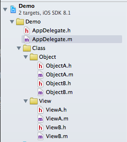
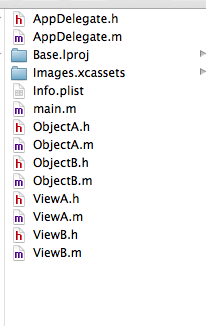
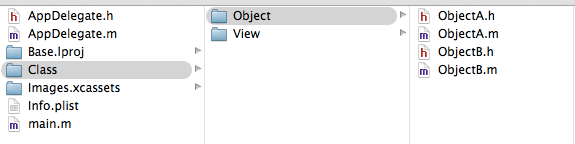
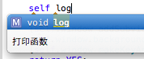

# 开发规范文档

## 目录

1. 工程目录规范
2. 代码规范
3. 框架使用规范

## 工程目录规范

创建项目以后，必须注意的是将对象进行归类。

**正确做法**：在工程项目中创建文件夹，保证项目内目录与外部文件夹结构一致。

**错误做法**：创建项目之后，直接在工程中创建项目，而对象一直存储在工程目录的同级目录，导致所有资源文件全部存放在一起，难以管理。

### 图文说明:



上图为项目中的管理对象属性图，而项目工程文件夹的管理需要进行相应的树形结构管理。 

下面则为两种不同的项目工程管理方式。

#### 错误做法



当创建对象达到上百个时，此时工程项目中将会变得非常杂乱，这样也会导致将来想引用该工程的部分组件时，找起来非常的不便。

#### 推荐做法



做到工程文件与文件夹结构一致，清晰明了，易于管理。

## 代码规范

开发项目时，应该做到的代码规范。

### 命名规范

命名规范推荐使用驼峰式。

|类型|格式|举例|
|---|---|---|
|类名|大驼峰|`NSString，NSArray，UIView`  |
|变量|小驼峰|`string，dataArray，userInfoView`|  
|函数|小驼峰|`- (void)addSubview:(UIView *)view;`  |
|宏定义|全大写|`VIEW_HEIGHT，VIEW_WIDTH`|

### 注释规范

开发过程中，注释需要好好的进行填写，特别是对函数的注释。一般情况下，源程序有效注释量必须在30%以上。 

注释分为两类

1. 函数注释
2. 执行代码注释

**注释参考**

```
/**
 *  打印函数
 */
- (void)log
{
    // 打印内容
    NSLog(@"Hello World");
}
```

可能你会问为什么这么注释呢？

如下图所示，调用的时候，函数的具体信息将会告诉调用者，清晰明了。



### 其他注意事项

#### 代码缩进（一个缩进为四空格）

请一定要在正确的地方使用缩进，这样可以提高代码的可阅读行。

#### 代码断行
 
代码在一行的列数请勿超过80，超过需要进行断行。

提示设置

1. 打开Xcode
2. Command + ,
3. 选择`Text Editing`
4. 勾选`page guide at column`，在后面括号填入一行最大列数

#### 代码换行

`if`，`while`，`for`，需要在开始前与结束后加入换行，例如

```
- (void)func
{
    [self run];
    
    if (true) {
        // 上下需要换行
    }
    
    [self run];
}
```
 


 